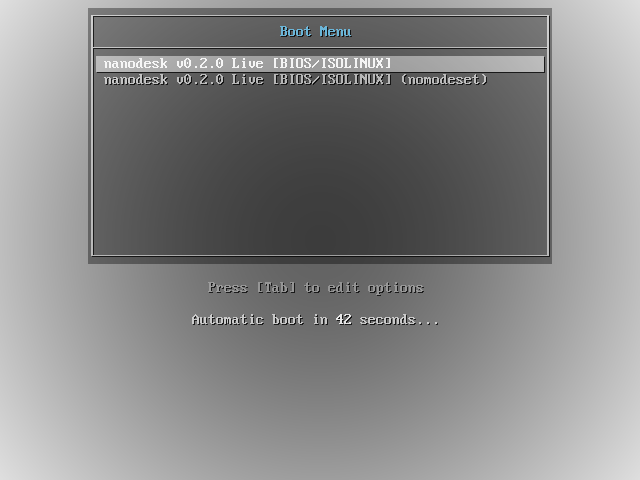
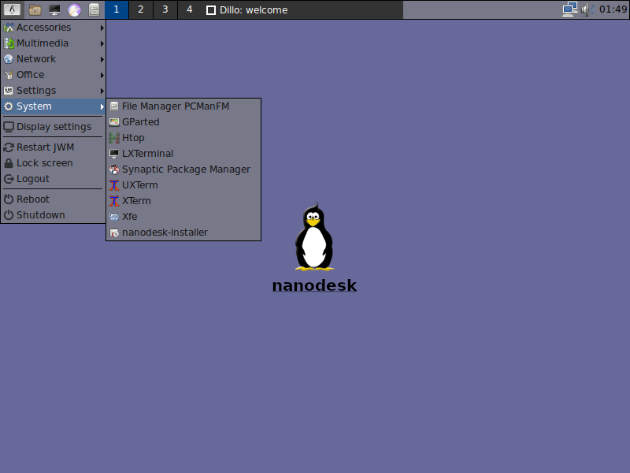
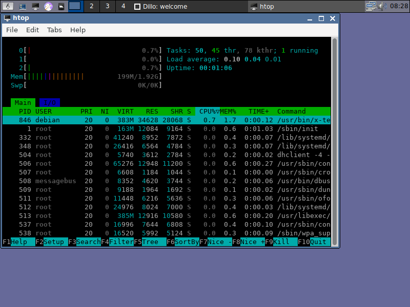

# nanodesk

nanodesk is a less resources consuming debian linux distro, which I made for fun and learning.
It's using jwm as window manager.

My goal is to have a (live) system which is very lightweight and usable too. This is for a VM where you need a basic graphical environment or for an old computer with less resources.

## Screenshots

The most important thing about a completely useless linux distro are the screenshots.

Here you go!










## Build it your own!

If you want to build nanodesk by your own, maybe with your own customisations - `makeanything.sh` will cover you.

This script will perform all tasks which are necessary to build nanodesk from scratch, including installing packages on your host machine where you build nanodesk.

The script is tested running with Ubuntu 22.04.

Simply run `./makeeverything.sh` and the show start!

You can give the script a custom debian-mirror, if your prefer `./makeanything.sh http://ftp.debian.org/debian/`

## customize nanodesk

Of course you can customize nanodesk to fit your needs! Just have a look into `makeanything.sh` and add your favorite packages to it.

You can also jump into the chroot with `chroot build/chroot/ /bin/bash` and do customisations by hand. Just run `makeanything.sh` afterwards to recreate the .iso

## install nanodesk on harddrive

When you booted nanodesk from the iso, then you can install nanodesk to your harddrive. In the homefolder of `root` ist the installerscript `install_nanodesk.sh`

Before doing so, you have to create, if not already existing, a partition with a formatted linux compatible filesystem (e.g. ext4).

nanodesk comes with fdisk, so you can create it very quick and format the partition afterwards. When you decide to create a swap-partiotion, do not forget to run mkswap.
Then the installer will detect it automatically (I hope so!) and use it.

This is an example, how to do the partitioning and formatting.

```bash
debian@nanodesk:~$ sudo su -
root@nanodesk:~# fdisk /dev/sda

Welcome to fdisk (util-linux 2.36.1).
Changes will remain in memory only, until you decide to write them.
Be careful before using the write command.


Command (m for help): o
Created a new DOS disklabel with disk identifier 0xe29b8e3b.

Command (m for help): n
Partition type
   p   primary (0 primary, 0 extended, 4 free)
   e   extended (container for logical partitions)
Select (default p): p
Partition number (1-4, default 1): 1
First sector (2048-16777215, default 2048): 
Last sector, +/-sectors or +/-size{K,M,G,T,P} (2048-16777215, default 16777215): +7700M

Created a new partition 1 of type 'Linux' and of size 7.5 GiB.

Command (m for help): n
Partition type
   p   primary (1 primary, 0 extended, 3 free)
   e   extended (container for logical partitions)
Select (default p): 

Using default response p.
Partition number (2-4, default 2): 
First sector (15771648-16777215, default 15771648): 
Last sector, +/-sectors or +/-size{K,M,G,T,P} (15771648-16777215, default 16777215): 

Created a new partition 2 of type 'Linux' and of size 491 MiB.

Command (m for help): t
Partition number (1,2, default 2): 2
Hex code or alias (type L to list all): 82

Changed type of partition 'Linux' to 'Linux swap / Solaris'.

Command (m for help): w
The partition table has been altered.
Calling ioctl() to re-read partition table.
Syncing disks.

root@nanodesk:~# mkfs.ext4 /dev/sda1
mke2fs 1.46.2 (28-Feb-2021)
Creating filesystem with 1971200 4k blocks and 492880 inodes
Filesystem UUID: 59b069ae-d9be-4fc0-a277-4204d20dc293
Superblock backups stored on blocks: 
	32768, 98304, 163840, 229376, 294912, 819200, 884736, 1605632

Allocating group tables: done                            
Writing inode tables: done                            
Creating journal (16384 blocks): done
Writing superblocks and filesystem accounting information: done 

root@nanodesk:~# mkswap /dev/sda2
Setting up swapspace version 1, size = 491 MiB (514846720 bytes)
no label, UUID=700c237a-d6ff-45d5-9cd9-8d623e851e06

root@nanodesk:~# ./install_nanodesk.sh /dev/sda1
```

## Download

Yeah, you can download the .iso file. 

[Download .iso at retro.la10cy.net](http://retro.la10cy.net/nanodesk/)

## Resources

- Linux Logo Button: https://freesvg.org/linux-key-vector-button
- xdgmenumaker deb package: https://bgstack15.wordpress.com/2020/03/03/package-for-devuan-xdgmenumaker/
- How To debootstrap a small desktop system: https://git.la10cy.net/DeltaLima/devnull/src/branch/main/debootstrap_minimal_dekstop_from_scratch.md
- How To create a linux live cd: https://www.willhaley.com/blog/custom-debian-live-environment/
