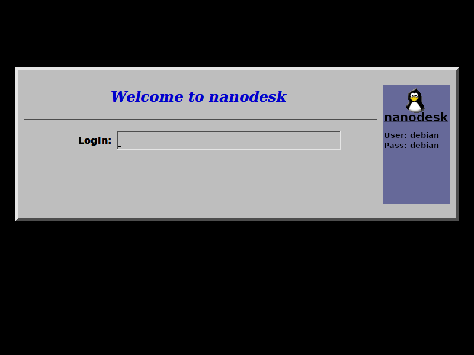
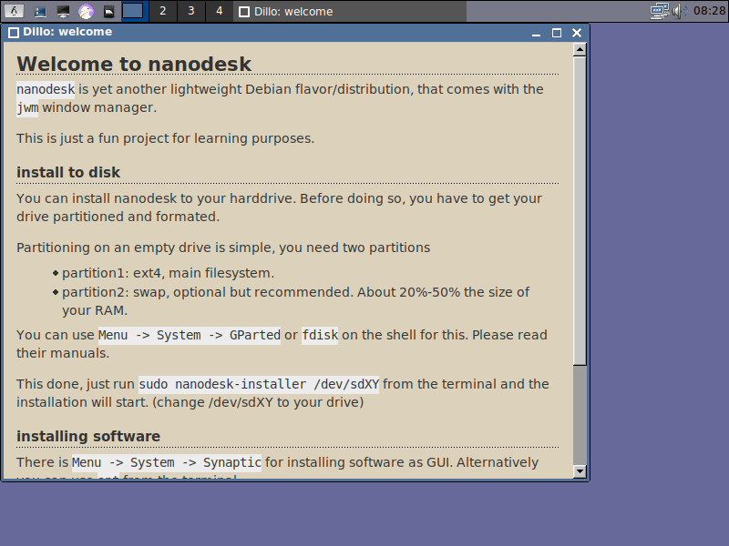

# nanodesk

nanodesk is a less resources consuming debian linux distro, which I made for fun and learning.
It's using jwm as window manager.

My goal is to have a (live) system which is very lightweight and usable too. This is for a VM where you need a basic graphical environment or for an old computer with less resources.

## Screenshots

The most important thing about a completely useless linux distro are the screenshots.
Here you go!

## Resources

- Linux Logo Buttom: https://freesvg.org/linux-key-vector-button
- xdgmenumaker deb package: https://bgstack15.wordpress.com/2020/03/03/package-for-devuan-xdgmenumaker/
- How To debootstrap a small desktop system: https://git.la10cy.net/DeltaLima/devnull/src/branch/main/debootstrap_minimal_dekstop_from_scratch.md
- How To create a linux live cd: https://www.willhaley.com/blog/custom-debian-live-environment/
